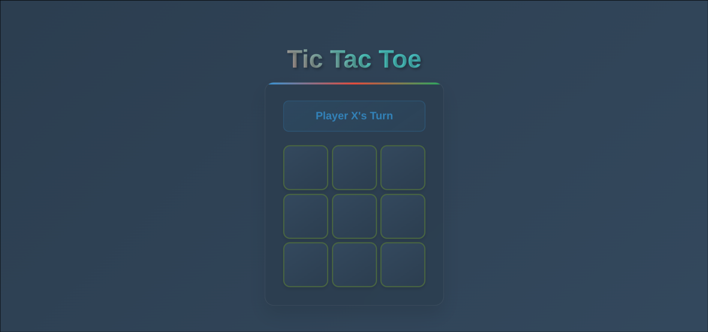
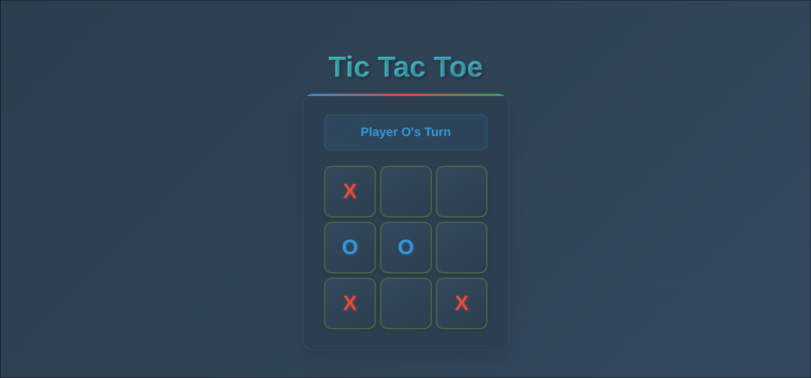
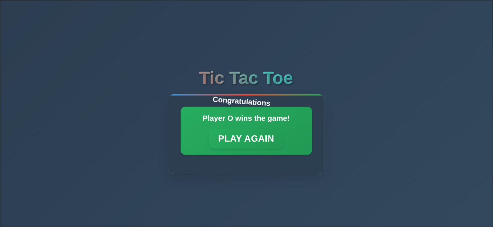

# Tic Tac Toe Game

A modern, responsive tic-tac-toe game built with React and enhanced with beautiful animations and glassmorphism design. This project demonstrates clean code architecture, smooth user interactions, and modern web development practices.

## Features

- **Interactive Gameplay**: Classic tic-tac-toe game for two players
- **Modern Design**: Glassmorphism UI with gradient backgrounds and smooth animations
- **Responsive Layout**: Optimized for desktop, tablet, and mobile devices
- **Visual Feedback**: Hover effects, click animations, and celebration sequences
- **Game State Management**: Automatic winner detection and draw game handling
- **Accessibility**: Keyboard navigation support and screen reader friendly

## Technology Stack

- **React**: Frontend framework for building the user interface
- **CSS3**: Advanced styling with flexbox, grid, animations, and modern CSS features
- **Vite**: Fast development build tool for optimal performance
- **ESLint**: Code quality and consistency enforcement

## Game Screenshots

### Starting the Game


_The initial game state with a clean, modern interface and animated title_

### During Gameplay


_Active gameplay showing the turn indicator and placed moves with visual feedback_

### Game Completion


_Victory screen with celebration animation and play again functionality_

## Installation and Setup

1. **Clone the repository**

   ```bash
   git clone [repository-url]
   cd tic-tac-toe
   ```

2. **Install dependencies**

   ```bash
   npm install
   ```

3. **Start the development server**

   ```bash
   npm run dev
   ```

4. **Open your browser**
   Navigate to `http://localhost:5173` to play the game

## Project Structure

```
src/
├── TicTacToeGame/
│   ├── Board.jsx          # Main game logic and board layout
│   └── Square.jsx         # Individual square component
├── App.jsx                # Main application component
├── App.css                # Core styling and layout
├── index.css              # Global styles and CSS variables
├── animations.css         # Advanced animations and effects
└── main.jsx              # Application entry point
```

## Game Rules

1. **Objective**: Get three of your marks (X or O) in a row, column, or diagonal
2. **Players**: Two players take turns, with X going first
3. **Moves**: Click on any empty square to place your mark
4. **Winning**: First player to achieve three in a row wins
5. **Draw**: If all squares are filled without a winner, the game is a draw
6. **Reset**: Click "Play Again" to start a new game

## Design Features

### Visual Elements

- **Gradient Backgrounds**: Beautiful color transitions throughout the interface
- **Glassmorphism**: Semi-transparent elements with backdrop blur effects
- **Smooth Animations**: Piece placement, hover effects, and victory celebrations
- **Color Coding**: X pieces in red, O pieces in blue for easy distinction

### Responsive Design

- **Mobile First**: Optimized touch targets and spacing for mobile devices
- **Flexible Layout**: Adapts to different screen sizes and orientations
- **Touch Feedback**: Enhanced interactions for touchscreen devices

### Accessibility

- **Keyboard Navigation**: Full keyboard support for all interactive elements
- **Focus Indicators**: Clear visual feedback for keyboard users
- **Semantic HTML**: Proper structure for screen readers
- **Color Contrast**: High contrast ratios for better readability

## Development

### Available Scripts

- `npm run dev` - Start development server
- `npm run build` - Build for production
- `npm run preview` - Preview production build
- `npm run lint` - Run ESLint for code quality

### Code Quality

- **Component Architecture**: Modular React components with clear separation of concerns
- **State Management**: Efficient use of React hooks for game state
- **Performance**: Optimized rendering and minimal re-renders
- **Maintainability**: Well-commented code and consistent styling patterns

## Browser Support

- **Modern Browsers**: Chrome, Firefox, Safari, Edge (latest versions)
- **Mobile Browsers**: iOS Safari, Chrome Mobile, Samsung Internet
- **Features**: CSS Grid, Flexbox, CSS Variables, and modern JavaScript

## Contributing

Contributions are welcome! Please feel free to submit pull requests or open issues for bugs and feature requests.

## License

This project is open source and available under the MIT License.
